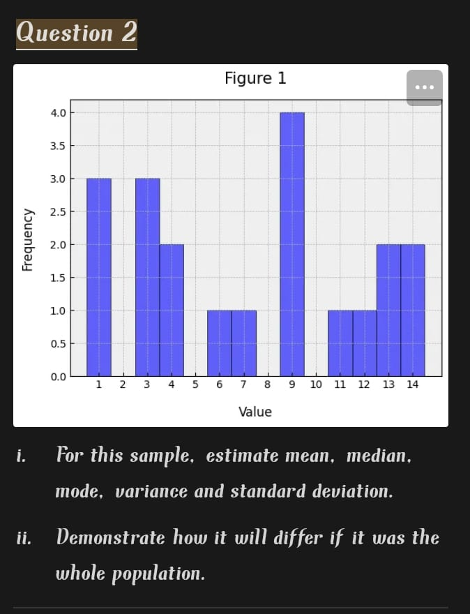
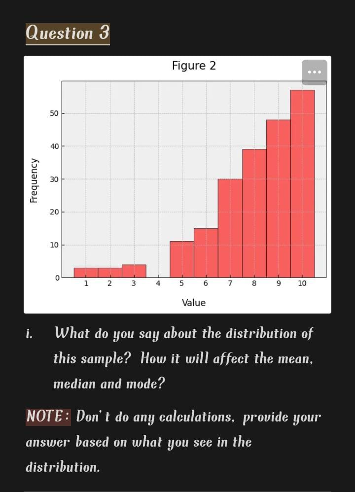

# Question 1

## 1. Mean, Median, and Mode

- **Mean**: is the summing all values and dividing by the number of values.
  - **Example**:  the mean salary of employees helps  understanding the overall payroll expense.
- **Median**: The middle value of a dataset when arranged in order. 
  - **Example**: When evaluating house prices, the median is better than the mean to represent central tendency if some houses are extremely expensive.
- **Mode**: The most repeated value in a dataset.
  - **Example**: In retail, the mode of shoe sizes helps identify the most commonly sold size.

---

## 2. Variance and Standard Deviation

- **Variance**: Measures the average squared deviation of each data point from the mean, indicating how spread out the data is.
- **Standard Deviation**: The square root of the variance. It gives a measure of spread in the same units as the data.
- **Relationship**: Standard deviation is the square root of variance, making it more interpretable in terms of the original data scale.
  - **Formula**:  
    - Variance  Var[X]=∑x∈SP[X=x](x−μ)2
    - Standard Deviation (\(\sigma\)) = \(\sqrt{\sigma^2}\)

---

## 3. Left and Right Skewness

- **Left Skewness (Negative Skew)**:
  - Tail is longer on the left side.
  - Order: Mean < Median < Mode.
  - **Example**: Age of retirement in a country where most people retire around the same age, but a few retire very early.
- **Right Skewness (Positive Skew)**:
  - Tail is longer on the right side.
  - Order: Mode < Median < Mean.
  - **Example**: Income distribution where a small percentage of people earn significantly more than the majority.

---

## 4. Outliers

- **Definition**: Data points that are significantly different from the majority of the data.
  - **Effects**:
    - Skew mean.
    - Increase standard deviation.
    - Often don’t affect median or mode.
  - **Real-world Example**: A student scoring 100 in a class where most scores are between 60 and 80.

---

## 5. Population vs. Sample

- **Population**: Entire set of data points or subjects of interest.
  - **Example**: All students in a country.
- **Sample**: A subset of the population used to make inferences about the population.
  - **Example**: 500 students selected randomly from a country.
- **Measurements**:
  - Mean, median, and mode are calculated for both.
  - Notation differences:
    - Population mean: \(\mu\), sample mean: \(\bar{x}\).
    - Population variance: \(\sigma^2\), sample variance: \(s^2\).

---

## 6. Discrete vs. Continuous Random Variables

- **Discrete**: Takes specific, countable values.
  - **Example**: Number of cars sold by a dealership in a day.
- **Continuous**: Can take any value within a range.
  - **Example**: Weight of a randomly selected apple.

---

## 7. Probability Mass Function (PMF) vs. Probability Density Function (PDF)

- **PMF**:
  - Used for discrete random variables.
  - Gives the probability of a random variable being exactly equal to a specific value.
  - **Example**: \(P(X = 3)\) for a dice roll.
- **PDF**:
  - Used for continuous random variables.
  - Represents the density of probability at a specific point; probabilities are obtained over intervals.
  - **Example**: \(P(a \leq X \leq b)\) for the height of people in a population.

---

## 8. Normal Distribution and Standard Deviations

- In a normal distribution:
  - Approximately **68%** of data falls within **1 standard deviation** of the mean.
  - Approximately **95%** of data falls within **2 standard deviations** of the mean.
  - Approximately **99.7%** of data falls within **3 standard deviations** of the mean.

# Question 2

### Tasks:
1. Estimate the following for the given sample:
   - Mean
   - Median
   - Mode
   - Variance
   - Standard Deviation

2. Demonstrate how the results will differ if the data is considered as a whole population.

---

## Solution with Steps:

### 1. Extract the Data:
- **x-axis values (Values):** 1, 2, 6, 8, 11, 12, 14
- **Frequencies (y-axis):** 3, 3, 1, 4, 2, 2, 1

---

### 2. Expand the Dataset:
The dataset is expanded by repeating each value based on its frequency:

`[1, 1, 1, 2, 2, 2, 6, 8, 8, 8, 8, 11, 11, 12, 12, 14]`

---

### 3. Calculations:

#### (a) Mean:
The formula for the mean is:

\[ \text{Mean} = \frac{\text{Sum of all values}}{\text{Number of values}} \]

\[ \text{Mean} = \frac{(1 + 1 + 1 + 2 + 2 + 2 + 6 + 8 + 8 + 8 + 8 + 11 + 11 + 12 + 12 + 14)}{16} = 6.6875 \]

---

#### (b) Median:
The dataset is already arranged in ascending order.

Since the dataset has an even number of values (16):
- The median is the average of the two middle numbers.
- Middle numbers: 8 and 8.

\[ \text{Median} = \frac{8 + 8}{2} = 8 \]

---

#### (c) Mode:
The mode is the value that appears most frequently.
- Here, 8 occurs 4 times, the highest frequency.

\[ \text{Mode} = 8 \]

---

#### (d) Variance for a Sample:
The formula for sample variance is:

\[ \text{Variance (Sample)} = \frac{\sum (x_i - \bar{x})^2}{n-1} \]

Where:
- \( x_i \): Each value in the dataset.
- \( \bar{x} \): Mean.
- \( n-1 \): Degrees of freedom (sample size - 1).

After calculation:

\[ \text{Variance (Sample)} = 21.1625 \]

---

#### (e) Standard Deviation for a Sample:
The standard deviation is the square root of the variance:

\[ \text{Standard Deviation} = \sqrt{\text{Variance}} \]

\[ \text{Standard Deviation (Sample)} = \sqrt{21.1625} \approx 4.60 \]

---

### 4. Population Metrics:
If the data represents the whole population:

#### (a) Variance for Population:
The formula changes to:

\[ \text{Variance (Population)} = \frac{\sum (x_i - \mu)^2}{n} \]

\[ \text{Population Variance} = 19.8398 \]

#### (b) Standard Deviation for Population:
\[ \text{Standard Deviation (Population)} = \sqrt{\text{Variance (Population)}} \]

\[ \text{Standard Deviation (Population)} = \sqrt{19.8398} \approx 4.45 \]

---

# Question 3

### Task:
1. Analyze the distribution of this sample.
2. Explain how the distribution affects the mean, median, and mode.

**Note:** No calculations are required. Base your answer on the visual distribution.

---

## Solution:

The distribution shown in the histogram appears to be **positively skewed** (right-skewed), as the frequency increases as the value progresses, and then it drops off sharply at the higher end.

### Implications on Mean, Median, and Mode:
1. **Mean:** The mean is likely to be **pulled towards the higher values** due to the skewness (influence of the larger values on the average).
2. **Median:** The median will lie **between the mode and the mean**, as it is less affected by extreme values.
3. **Mode:** The mode will be the **most frequent lower value** as it represents the peak of the distribution.

---
